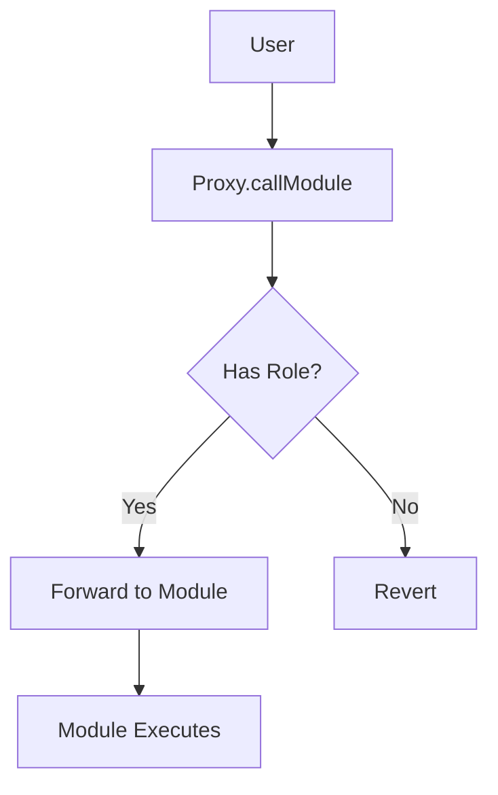
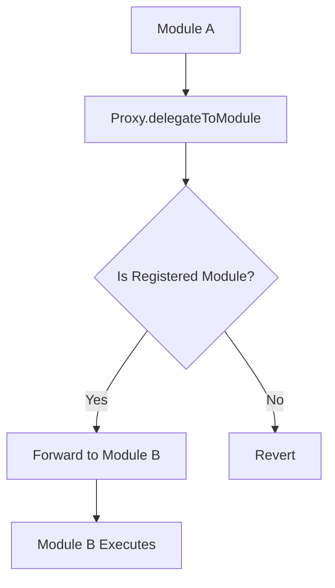
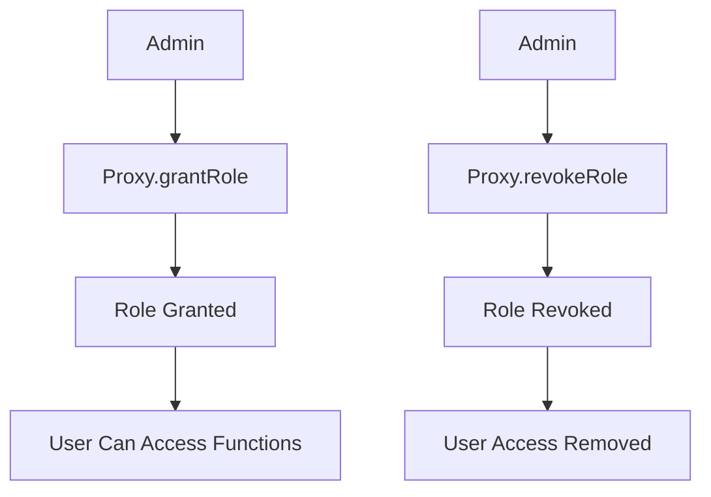

# SovereignSeas V5 Access Control Architecture

## Overview

This document describes the redesigned access control architecture for SovereignSeas V5, which addresses the access control conflicts and storage layout issues present in the previous implementation.

## Problem Statement

The previous architecture had several critical issues:

1. **Access Control Conflicts**: Both proxy and modules had their own AccessControl systems
2. **Storage Layout Issues**: Using `delegatecall` caused storage conflicts between proxy and modules
3. **Message Context Loss**: `msg.sender` and `msg.value` were not properly preserved
4. **Cross-Module Communication**: Modules couldn't properly call each other through the proxy
5. **Role Management**: No unified way to manage roles across all contracts

## Solution Architecture

### 1. Centralized Access Control

The `SovereignSeasV5` proxy contract is now the **central authority** for all access control decisions:

```solidity
contract SovereignSeasV5 is AccessControlUpgradeable {
    // Centralized role definitions
    bytes32 public constant ADMIN_ROLE = keccak256("ADMIN_ROLE");
    bytes32 public constant MANAGER_ROLE = keccak256("MANAGER_ROLE");
    bytes32 public constant OPERATOR_ROLE = keccak256("OPERATOR_ROLE");
    bytes32 public constant EMERGENCY_ROLE = keccak256("EMERGENCY_ROLE");
    
    // Module-specific roles
    bytes32 public constant PROJECTS_ADMIN_ROLE = keccak256("PROJECTS_ADMIN_ROLE");
    bytes32 public constant CAMPAIGNS_ADMIN_ROLE = keccak256("CAMPAIGNS_ADMIN_ROLE");
    bytes32 public constant VOTING_ADMIN_ROLE = keccak256("VOTING_ADMIN_ROLE");
    bytes32 public constant TREASURY_ADMIN_ROLE = keccak256("TREASURY_ADMIN_ROLE");
    bytes32 public constant POOLS_ADMIN_ROLE = keccak256("POOLS_ADMIN_ROLE");
    bytes32 public constant MIGRATION_ADMIN_ROLE = keccak256("MIGRATION_ADMIN_ROLE");
}
```

### 2. Call Forwarding Instead of Delegatecall

The proxy now uses **call forwarding** instead of `delegatecall`:

```solidity
function callModule(string calldata _moduleId, bytes calldata _data) 
    external 
    payable  // Accepts CELO value
    returns (bytes memory) 
{
    address moduleAddress = modules[_moduleId];
    
    // Forward the call with value and context
    (bool success, bytes memory result) = moduleAddress.call{value: msg.value}(_data);
    
    if (!success) {
        assembly {
            revert(add(result, 32), mload(result))
        }
    }
    
    return result;
}
```

**Benefits:**
- ✅ Preserves `msg.sender` and `msg.value`
- ✅ No storage layout conflicts
- ✅ Proper CELO value forwarding
- ✅ Clean separation of concerns

### 3. Stateless Modules

Modules are now **stateless** and focus purely on business logic:

```solidity
contract ProjectsModule is BaseModule {
    // No AccessControl inheritance
    // No role management
    // Pure business logic
    
    modifier onlyAdmin() {
        require(_isAdmin(msg.sender), "ProjectsModule: Admin role required");
        _;
    }
}
```

**Benefits:**
- ✅ No access control conflicts
- ✅ Simpler module logic
- ✅ Easier to audit and maintain
- ✅ Consistent permission model

### 4. Cross-Module Communication

Modules communicate through the proxy using the `callModule` pattern:

```solidity
// In ProjectsModule
function _transferCreationFeeToTreasury() internal {
    bytes memory treasuryData = abi.encodeWithSignature(
        "collectFee(address,uint256,string)",
        msg.sender,
        0.5 ether,
        "project_creation"
    );
    
    try this.callModule("treasury", treasuryData) {
        // Fee collected successfully
    } catch {
        // Handle failure gracefully
    }
}
```

## Contract Structure

### SovereignSeasV5 (Main Proxy)

**Responsibilities:**
- Centralized access control management
- Module registration and management
- Call routing and value forwarding
- System-wide pause functionality

**Key Functions:**
- `callModule()` - Forward calls to modules with value
- `delegateToModule()` - Internal module-to-module communication
- `staticCallModule()` - View-only module calls
- `registerModule()` - Add new modules
- `grantRole()` / `revokeRole()` - Manage permissions

### BaseModule

**Responsibilities:**
- Common module functionality
- Proxy integration
- Basic state management
- Role checking through proxy

**Key Functions:**
- `initialize()` - Set up module with proxy reference
- `callModule()` - Call other modules through proxy
- `callModuleView()` - View-only cross-module calls
- `_isAdmin()`, `_isManager()`, etc. - Role checking

### Individual Modules

**Responsibilities:**
- Business logic implementation
- Data storage and management
- Event emission
- Cross-module coordination

**Examples:**
- `ProjectsModule` - Project creation and management
- `CampaignsModule` - Campaign creation and funding
- `VotingModule` - Voting mechanisms
- `TreasuryModule` - Fee collection and management

## Access Control Flow

### 1. User Permission Check



### 2. Cross-Module Permission Check



### 3. Role Management



## Deployment Process

### 1. Deploy Contracts

```bash
# Deploy proxy
npx hardhat run scripts/deploy-v5-production.ts --network <network>
```

### 2. Initialize System

```typescript
// 1. Initialize proxy with deployer as admin
await sovereignSeasV5.initialize(deployer.address);

// 2. Register modules
await sovereignSeasV5.registerModule("projects", projectsModule.address, []);
await sovereignSeasV5.registerModule("campaigns", campaignsModule.address, []);

// 3. Initialize modules with proxy reference
await projectsModule.initialize(sovereignSeasV5.address, "0x");
await campaignsModule.initialize(sovereignSeasV5.address, "0x");
```

### 3. Grant Additional Roles

```typescript
// Grant specific module admin roles
await sovereignSeasV5.grantRole(await sovereignSeasV5.PROJECTS_ADMIN_ROLE(), teamMember.address);
await sovereignSeasV5.grantRole(await sovereignSeasV5.CAMPAIGNS_ADMIN_ROLE(), teamMember.address);
```

## Security Features

### 1. Access Control

- **Role-based permissions** for all administrative functions
- **Module-specific roles** for granular control
- **Emergency roles** for crisis management
- **Role inheritance** for simplified management

### 2. Module Security

- **Only proxy can call** module administrative functions
- **Module-to-module communication** through proxy only
- **No direct external calls** to sensitive functions
- **Graceful failure handling** for cross-module calls

### 3. Value Security

- **Proper CELO forwarding** to modules
- **Emergency withdrawal** functions for admin
- **Value validation** in module functions
- **Fee collection** through treasury module

## Testing

### Run Tests

```bash
# Run all tests
npx hardhat test

# Run specific test file
npx hardhat test test/v5-access-control.test.ts

# Run with coverage
npx hardhat coverage
```

### Test Coverage

The test suite covers:
- ✅ Contract deployment and initialization
- ✅ Module registration and management
- ✅ Access control enforcement
- ✅ Cross-module communication
- ✅ Value forwarding
- ✅ Role management
- ✅ Emergency functions

## Migration from V4

### 1. Data Migration

```typescript
// Use MigrationModule for data transfer
await migrationModule.migrateFromV4(v4ProjectId, v4Data);
```

### 2. Role Migration

```typescript
// Grant equivalent roles in V5
await sovereignSeasV5.grantRole(ADMIN_ROLE, v4Admin.address);
await sovereignSeasV5.grantRole(MANAGER_ROLE, v4Manager.address);
```

### 3. Function Mapping

| V4 Function | V5 Equivalent |
|-------------|---------------|
| `createProject()` | `proxy.callModule("projects", createProjectData)` |
| `createCampaign()` | `proxy.callModule("campaigns", createCampaignData)` |
| `vote()` | `proxy.callModule("voting", voteData)` |

## Best Practices

### 1. Module Design

- Keep modules focused on single responsibility
- Use events for important state changes
- Implement graceful failure handling
- Minimize cross-module dependencies

### 2. Access Control

- Grant minimal required permissions
- Use module-specific roles when possible
- Regularly audit role assignments
- Implement role expiration if needed

### 3. Gas Optimization

- Batch operations when possible
- Use efficient data structures
- Minimize storage operations
- Optimize cross-module calls

## Troubleshooting

### Common Issues

1. **Module not found**: Check module registration
2. **Access denied**: Verify role assignments
3. **Value not forwarded**: Ensure `callModule` is `payable`
4. **Cross-module call fails**: Check module dependencies

### Debug Commands

```typescript
// Check module status
await sovereignSeasV5.isModuleRegistered("projects");
await sovereignSeasV5.moduleActive("projects");

// Check role assignments
await sovereignSeasV5.hasRole(ADMIN_ROLE, user.address);

// Check module addresses
await sovereignSeasV5.getModuleAddress("projects");
```

## Future Enhancements

### 1. Role Expiration

```solidity
mapping(bytes32 => mapping(address => uint256)) public roleExpiry;
```

### 2. Multi-Sig Support

```solidity
contract MultiSigModule is BaseModule {
    function proposeAction(bytes calldata action) external;
    function approveAction(uint256 actionId) external;
}
```

### 3. Advanced Permissions

```solidity
contract PermissionModule is BaseModule {
    function checkPermission(address user, string calldata resource, string calldata action) external view returns (bool);
}
```

## Conclusion

The new SovereignSeas V5 access control architecture provides:

- ✅ **Centralized control** through the proxy
- ✅ **Clean separation** of concerns
- ✅ **Proper value forwarding** for CELO
- ✅ **Secure cross-module communication**
- ✅ **Scalable role management**
- ✅ **Maintainable codebase**

This architecture resolves all the issues present in the previous implementation while maintaining the modular design and upgradeability features that make SovereignSeas V5 powerful and flexible.
