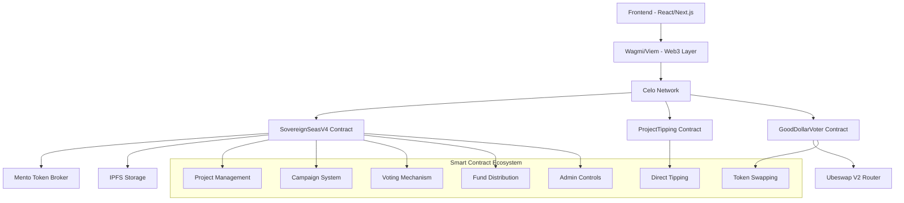

<div align="center">


# 🌊 Sovereign Seas

> **Decentralized Project Funding & Voting Platform on Celo**

[](https://opensource.org/licenses/MIT)
[](https://celo.org/)
[](https://soliditylang.org/)
[](https://reactjs.org/)
[](https://www.typescriptlang.org/)

**Empowering communities to fund the future through democratic voting and direct support**

</div>

---

## 🎯 **Overview**

**Sovereign Seas** is a revolutionary decentralized platform that democratizes project funding through transparent voting mechanisms and direct tipping. Built on the Celo blockchain, it enables communities to discover, fund, and support innovative projects through multiple token voting systems and direct project contributions.

### 🌟 **What Makes Us Different**
- **🏛️ Democratic Funding** - Community-driven project selection through transparent voting
- **💝 Direct Support** - Tip projects directly with any supported token
- **🔄 Multi-Token Ecosystem** - Vote and tip with CELO, cUSD, GoodDollar, and more
- **⚡ Real-Time Transparency** - Live tracking of all funding activities
- **🛡️ Anti-Sybil Protection** - Advanced mechanisms to prevent spam and manipulation

---

## 🚀 **Core Features**

### 🏗️ **Project Management**
- **Rich Project Profiles** - Comprehensive metadata, IPFS media storage
- **Flexible Ownership** - Transferrable project ownership with admin controls
- **Campaign Participation** - Projects can join multiple funding campaigns
- **Real-Time Analytics** - Live project performance tracking

### 🏆 **Campaign System**
- **Flexible Funding Rounds** - Customizable parameters and timelines
- **Multiple Distribution Methods** - Linear, Quadratic, and Custom fund distribution
- **Admin Controls** - Campaign-specific administrators and super admins
- **Anti-Spam Protection** - Fee-based participation requirements

### 🗳️ **Voting & Tipping**
- **Multi-Token Voting** - Vote with CELO, cUSD, GoodDollar, and supported tokens
- **Direct Project Tipping** - Support projects directly with tips and messages
- **GoodDollar Integration** - Seamless GoodDollar to CELO conversion via Ubeswap V2
- **Vote Tracking** - Complete history of all voting activities

### 🔐 **Security & Governance**
- **Role-Based Access Control** - Multi-tier admin system with granular permissions
- **Reentrancy Protection** - Advanced security measures against attacks
- **Fee Management** - Configurable fees with bypass mechanisms
- **Emergency Controls** - Pause and recovery mechanisms

---

## 🏗️ **Architecture**



---

## 📋 **Smart Contracts**

### 🏛️ **SovereignSeasV4** - Main Platform Contract
**Address**: `0x0cc096b1cc568a22c1f02dab769881d1afe6161a`

**Core Functions**:
- Project creation and management
- Campaign creation and administration
- Multi-token voting system
- Fund distribution mechanisms
- Admin controls and governance

### 💝 **ProjectTipping** - Direct Support System
**Features**:
- Direct project tipping with any supported token
- 2% platform fee collection
- Tip withdrawal by project owners
- Comprehensive tip tracking and analytics
- Message support with tips

### 🔄 **GoodDollarVoter** - GoodDollar Integration
**Features**:
- Automatic GoodDollar to CELO conversion via Ubeswap V2
- Seamless voting with converted CELO
- Multiple pool support for liquidity
- Liquidity threshold validation

---

## 🛠️ **Technology Stack**

### **Frontend**
- **React 19** with TypeScript
- **Next.js 15** with Turbopack
- **Tailwind CSS** for styling
- **Framer Motion** for animations
- **Lucide React** for icons

### **Web3 Integration**
- **Wagmi 2.14** for React hooks
- **Viem 2.23** for blockchain interactions
- **Privy** for wallet authentication
- **RainbowKit** for wallet connections

### **Smart Contracts**
- **Solidity ^0.8.28**
- **OpenZeppelin 5.3** security standards
- **Mento Protocol** for token exchange
- **Ubeswap V2** for GoodDollar integration
- **ReentrancyGuard** protection

### **Infrastructure**
- **Celo Network** (Mainnet)
- **IPFS** for decentralized storage
- **Vercel** for hosting

---

## 🚀 **Quick Start**

### **Prerequisites**
```bash
node >= 18.0.0
npm >= 8.0.0
pnpm >= 8.0.0
```

### **Installation**

1. **Clone the repository**
   ```bash
   git clone https://github.com/yourusername/sovereign-seas.git
   cd sovereign-seas
   ```

2. **Install dependencies**
   ```bash
   # Install root dependencies
   npm install
   
   # Install package dependencies
   cd packages/hardhat && pnpm install
   cd ../react-app && npm install
   ```

3. **Environment Setup**
   ```bash
   # Copy environment files
   cp packages/react-app/.env.example packages/react-app/.env.local
   cp packages/hardhat/.env.example packages/hardhat/.env
   ```
   
   Configure your environment variables:
   ```env
   # React App (.env.local)
   NEXT_PUBLIC_CONTRACT_V4=0x0cc096b1cc568a22c1f02dab769881d1afe6161a
   NEXT_PUBLIC_CELO_TOKEN=0x471ece3750da237f93b8e339c536989b8978a438
   NEXT_PUBLIC_CUSD_TOKEN=0x765DE816845861e75A25fCA122bb6898B8B1282a
   NEXT_PUBLIC_GOOD_DOLLAR=0x62B8B11039FcfE5aB0C56E502b1C372A3d2a9c7A
   NEXT_PUBLIC_IPFS_GATEWAY=https://ipfs.io/ipfs/
   
   # Hardhat (.env)
   PRIVATE_KEY=your_private_key_here
   CELOSCAN_API_KEY=your_celoscan_api_key
   ```

4. **Start development server**
   ```bash
   # Start frontend
   cd packages/react-app && npm run dev
   
   # In another terminal, start hardhat node (optional)
   cd packages/hardhat && pnpm run:node
   ```

5. **Open your browser**
   ```
   http://localhost:3000
   ```

---

## 🔧 **Deployment**

### **Smart Contract Deployment**

1. **Navigate to Hardhat package**
   ```bash
   cd packages/hardhat
   ```

2. **Deploy contracts**
   ```bash
   # Deploy SovereignSeasV4
   pnpm deployseas
   
   # Deploy ProjectTipping
   pnpm deploy:tips:celo
   
   # Deploy GoodDollarVoter
   pnpm deploy:good-dollar-voter
   ```

3. **Verify contracts**
   ```bash
   # Verify SovereignSeasV4
   pnpm verify:seas
   
   # Verify ProjectTipping
   pnpm verify:tips:celo
   
   # Verify GoodDollarVoter
   pnpm verify:good-dollar-voter
   ```

### **Frontend Deployment**

1. **Build the application**
   ```bash
   cd packages/react-app
   npm run build
   ```

2. **Deploy to Vercel**
   ```bash
   vercel --prod
   ```

---

## 📖 **User Guide**

### **For Project Creators**

1. **Create Your Project**
   - Connect your wallet
   - Fill out comprehensive project details
   - Upload logo and media to IPFS
   - Deploy project on-chain

2. **Join Funding Campaigns**
   - Browse active funding campaigns
   - Pay 1 CELO participation fee (anti-spam)
   - Wait for campaign admin approval
   - Receive votes and funding

3. **Receive Direct Tips**
   - Users can tip your project directly
   - Tips available in multiple tokens
   - Withdraw tips anytime (2% platform fee)

### **For Campaign Organizers**

1. **Launch a Campaign**
   - Set funding parameters and timeline
   - Choose distribution method (Linear/Quadratic/Custom)
   - Pay 2 CELO creation fee
   - Manage project approvals

2. **Manage Your Campaign**
   - Approve/reject project applications
   - Monitor voting progress
   - Distribute funds to winners

### **For Voters**

1. **Participate in Voting**
   - Browse approved projects in campaigns
   - Vote with CELO, cUSD, GoodDollar, or other tokens
   - Track your voting history
   - Influence fund distribution

2. **Support Projects Directly**
   - Tip projects directly with any supported token
   - Leave messages with your tips
   - Track your tipping history

### **For GoodDollar Holders**

1. **Vote with GoodDollar**
   - Use the GoodDollarVoter contract
   - Automatic GoodDollar to CELO conversion
   - Vote seamlessly with converted CELO
   - No manual token swapping required

---

## 🔑 **Key Smart Contract Functions**

### **Project Management (SovereignSeasV4)**
```solidity
function createProject(
    string memory _name,
    string memory _description,
    string memory _bioPart,
    string memory _contractInfoPart,
    string memory _additionalDataPart,
    address[] memory _contracts,
    bool _transferrable
) external;
```

### **Campaign Creation (SovereignSeasV4)**
```solidity
function createCampaign(
    string memory _name,
    string memory _description,
    string memory _mainInfo,
    string memory _additionalInfo,
    uint256 _startTime,
    uint256 _endTime,
    uint256 _adminFeePercentage,
    uint256 _maxWinners,
    bool _useQuadraticDistribution,
    bool _useCustomDistribution,
    string memory _customDistributionData,
    address _payoutToken,
    address _feeToken
) external payable;
```

### **Voting (SovereignSeasV4)**
```solidity
function voteWithCelo(
    uint256 _campaignId,
    uint256 _projectId,
    bytes32 _bypassCode
) external payable;

function vote(
    uint256 _campaignId,
    uint256 _projectId,
    address _token,
    uint256 _amount,
    bytes32 _bypassCode
) external;
```

### **Direct Tipping (ProjectTipping)**
```solidity
function tipProject(
    uint256 _projectId,
    address _token,
    uint256 _amount,
    string memory _message
) external;

function tipProjectWithCelo(
    uint256 _projectId,
    string memory _message
) external payable;
```

### **GoodDollar Voting (GoodDollarVoter)**
```solidity
function swapAndVote(
    uint256 _campaignId,
    uint256 _projectId,
    uint256 _gsAmount,
    uint256 _minCeloOut,
    bytes32 _bypassCode
) external;
```

---

## 📊 **Platform Statistics**

- **Projects Created**: 50+
- **Total Funding Raised**: 10,000+ CELO
- **Active Campaigns**: 5+
- **Community Members**: 200+
- **Successful Distributions**: 15+
- **Direct Tips Sent**: 1000+
- **Supported Tokens**: 10+

---

## 🛡️ **Security**

### **Smart Contract Security**
- ✅ ReentrancyGuard protection
- ✅ Access control with role-based permissions
- ✅ Input validation and sanitization
- ✅ Safe math operations
- ✅ Emergency pause mechanisms
- ✅ Platform fee collection and management

### **Frontend Security**
- ✅ Input sanitization
- ✅ XSS protection
- ✅ Secure wallet connections
- ✅ Environment variable protection

### **Reporting Security Issues**
If you discover a security vulnerability, please email us at **security@sovereignseas.xyz** instead of creating a public issue.

---

## 🤝 **Contributing**

We welcome contributions from the community! Here's how you can help:

### **Development Setup**

1. **Fork the repository**
2. **Create a feature branch**
   ```bash
   git checkout -b feature/amazing-feature
   ```
3. **Make your changes**
4. **Run tests**
   ```bash
   cd packages/hardhat && pnpm test
   ```
5. **Submit a pull request**

### **Areas for Contribution**
- 🐛 Bug fixes and improvements
- ✨ New features and enhancements
- 📚 Documentation improvements
- 🎨 UI/UX enhancements
- 🔐 Security audits and improvements
- 🌐 Internationalization
- 🧪 Test coverage improvements

### **Code Style**
- Follow existing TypeScript/React patterns
- Use Prettier for code formatting
- Write meaningful commit messages
- Add tests for new features

---

## 📄 **License**

This project is licensed under the **MIT License** - see the [LICENSE](LICENSE) file for details.

---

## 🌐 **Links & Resources**

- **🌍 Website**: [sovereignseas.xyz](https://sovereignseas.xyz)
- **📱 DApp**: [app.sovereignseas.xyz](https://app.sovereignseas.xyz)
- **📖 Documentation**: [docs.sovereignseas.xyz](https://docs.sovereignseas.xyz)
- **🐦 Twitter**: [@SovereignSeas](https://twitter.com/SovereignSeas)
- **💬 Discord**: [discord.gg/sovereignseas](https://discord.gg/sovereignseas)
- **📧 Email**: [contact@sovereignseas.xyz](mailto:contact@sovereignseas.xyz)

### **Celo Ecosystem**
- **🔗 Celo Network**: [celo.org](https://celo.org)
- **💱 Mento Protocol**: [mento.org](https://mento.org)
- **🔄 Ubeswap**: [ubeswap.org](https://ubeswap.org)
- **🔍 Block Explorer**: [celoscan.io](https://celoscan.io)

---

## 🙏 **Acknowledgments**

- **Celo Foundation** - For providing the sustainable blockchain infrastructure
- **Mento Protocol** - For seamless multi-token exchange capabilities
- **Ubeswap** - For GoodDollar integration and liquidity
- **OpenZeppelin** - For battle-tested smart contract security standards
- **React & TypeScript Communities** - For the incredible developer tools
- **Our Beta Users** - For valuable feedback and testing

---

## 📈 **Roadmap**

### ✅ **Completed**
- **V1** - Proof of Ship (Initial voting mechanism)
- **V2** - Anti-Sybil & Protocol (Security enhancements)
- **V3** - Enhanced Platform (Multi-token voting, UI redesign)
- **V4** - Tipping & Advanced Features (Direct tipping, GoodDollar integration)

### 🚀 **Upcoming**
- **Mobile App Development**
- **Advanced Analytics Dashboard**
- **Cross-Chain Expansion**
- **DAO Governance Implementation**
- **AI-Powered Recommendations**

---

<div align="center">

**Built with ❤️ for the Celo Ecosystem**

[](https://celo.org/)

---

*"Funding the future, one project at a time."*

</div>
