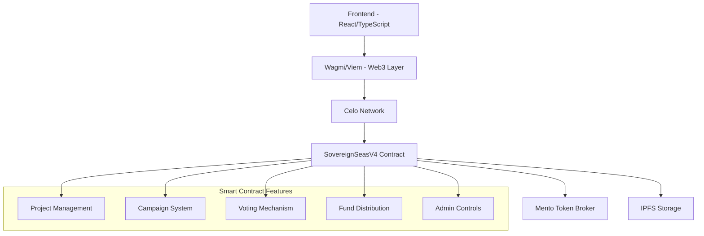

# 🌊 Sovereign Seas

> **Decentralized Project Funding & Voting Platform on Celo**

[](https://opensource.org/licenses/MIT)
[](https://celo.org/)
[](https://soliditylang.org/)
[](https://reactjs.org/)
[](https://www.typescriptlang.org/)

**Sovereign Seas** is a cutting-edge decentralized platform that enables transparent project funding through democratic voting mechanisms. Built on the Celo blockchain, it empowers communities to discover, fund, and support innovative projects through multiple token voting systems.

---

## 🚀 **Key Features**

### 💎 **Core Functionality**
- **🏗️ Project Creation & Management** - Complete project lifecycle with rich metadata
- **🏆 Campaign Funding** - Flexible funding rounds with customizable parameters  
- **🗳️ Multi-Token Voting** - Vote with CELO, cUSD, and other supported tokens
- **📊 Multiple Distribution Methods** - Linear, Quadratic, and Custom fund distribution
- **🔐 Anti-Sybil Protection** - Advanced spam prevention and fee mechanisms
- **⚡ Real-time Analytics** - Live campaign tracking and project insights

### 🛡️ **Security & Governance**
- **👑 Multi-tier Admin System** - Super admins and campaign-specific administrators
- **💰 Dynamic Fee Structure** - Configurable fees with bypass mechanisms
- **🔄 Token Exchange Integration** - Seamless multi-token support via Mento
- **📋 Comprehensive Audit Trail** - Full transparency with detailed event logging

### 🎨 **User Experience**
- **✨ Modern UI/UX** - Clean, responsive design with Framer Motion animations
- **🔍 Advanced Search & Filtering** - Powerful discovery mechanisms
- **📱 Mobile-First Design** - Optimized for all devices
- **🌐 IPFS Integration** - Decentralized media storage

---

## 🏗️ **Architecture Overview**



---

## 📋 **Platform Roadmap**

### ✅ **V1 - Proof of Ship** *(Completed)*
- Initial voting mechanism implementation
- 2-3 successful campaign launches
- Core user feedback collection
- Basic project and campaign system

### 🔄 **V2 - Anti-Sybil & Protocol** *(60% Complete)*
- Self-protocol development (60% testing complete)
- Good Dollar integration (10% complete)  
- Enhanced security measures
- Advanced spam prevention

### 🚀 **V3 - Enhanced Platform** *(Live)*
- ✅ New tested voting system
- ✅ Projects as moveable entities between campaigns
- ✅ Full Celo mainnet deployment
- ✅ Multi-token voting (CELO & cUSD)
- ✅ Complete platform redesign
- ✅ Advanced UI/UX with animations

---

## 🛠️ **Tech Stack**

### **Frontend**
- **React 18** with TypeScript
- **Framer Motion** for animations
- **Tailwind CSS** for styling
- **React Router** for navigation
- **Lucide React** for icons

### **Web3 Integration**
- **Wagmi** for React hooks
- **Viem** for Ethereum interactions
- **Privy** for wallet authentication
- **IPFS** for decentralized storage

### **Smart Contracts**

**Adresses**
v1- 0x2C378422434932d490ccdF674178e194842336a4
swapper-0xe0dbbaea6aacf915c2ede4540f1ba67a0658c931

v2-0x0cc096b1cc568a22c1f02dab769881d1afe6161a


- **Solidity ^0.8.28**
- **OpenZeppelin** security standards
- **Mento Protocol** for token exchange
- **ReentrancyGuard** protection

### **Blockchain**
- **Celo Network** (Mainnet)
- **CELO** and **cUSD** token support
- **Mento DEX** integration

---

## 🚀 **Quick Start**

### **Prerequisites**
```bash
node >= 18.0.0
npm >= 8.0.0
```

### **Installation**

1. **Clone the repository**
   ```bash
   git clone https://github.com/yourusername/sovereign-seas.git
   cd sovereign-seas
   ```

2. **Install dependencies**
   ```bash
   npm install
   ```

3. **Environment Setup**
   ```bash
   cp .env.example .env.local
   ```
   
   Configure your environment variables:
   ```env
   VITE_CONTRACT_V4=0x... # SovereignSeasV4 contract address
   VITE_CELO_TOKEN=0x471ece3750da237f93b8e339c536989b8978a438
   VITE_CUSD_TOKEN=0x765DE816845861e75A25fCA122bb6898B8B1282a
   VITE_IPFS_GATEWAY=https://ipfs.io/ipfs/
   ```

4. **Start development server**
   ```bash
   npm run dev
   ```

5. **Open your browser**
   ```
   http://localhost:5173
   ```

---

## 🔧 **Smart Contract Deployment**

### **Deploy to Celo**

1. **Install Hardhat**
   ```bash
   npm install --save-dev hardhat
   ```

2. **Configure Hardhat**
   ```javascript
   // hardhat.config.js
   module.exports = {
     networks: {
       celo: {
         url: "https://forno.celo.org",
         accounts: [process.env.PRIVATE_KEY],
         chainId: 42220
       }
     }
   };
   ```

3. **Deploy Contract**
   ```bash
   npx hardhat run scripts/deploy.js --network celo
   ```

### **Contract Verification**
```bash
npx hardhat verify --network celo DEPLOYED_CONTRACT_ADDRESS "CELO_TOKEN_ADDRESS" "MENTO_BROKER_ADDRESS"
```

---

## 📖 **Usage Guide**

### **For Project Creators**

1. **Create a Project**
   - Connect your wallet
   - Fill out comprehensive project details
   - Upload logo and media to IPFS
   - Deploy project on-chain

2. **Join Campaigns**
   - Browse active funding campaigns
   - Pay 1 CELO participation fee (anti-spam)
   - Wait for campaign admin approval
   - Receive votes and funding

### **For Campaign Organizers**

1. **Launch a Campaign**
   - Set funding parameters and timeline
   - Choose distribution method (Linear/Quadratic/Custom)
   - Pay 2 CELO creation fee
   - Manage project approvals

2. **Manage Campaigns**
   - Approve/reject project applications
   - Monitor voting progress
   - Distribute funds to winners

### **For Voters**

1. **Participate in Voting**
   - Browse approved projects in campaigns
   - Vote with CELO, cUSD, or other supported tokens
   - Track your voting history
   - Influence fund distribution

---

## 🔑 **Key Smart Contract Functions**

### **Project Management**
```solidity
function createProject(
    string memory _name,
    string memory _description,
    string memory _bioPart,
    string memory _contractInfoPart,
    string memory _additionalDataPart,
    address[] memory _contracts,
    bool _transferrable
) external;
```

### **Campaign Creation**
```solidity
function createCampaign(
    string memory _name,
    string memory _description,
    string memory _mainInfo,
    string memory _additionalInfo,
    uint256 _startTime,
    uint256 _endTime,
    uint256 _adminFeePercentage,
    uint256 _maxWinners,
    bool _useQuadraticDistribution,
    bool _useCustomDistribution,
    string memory _customDistributionData,
    address _payoutToken,
    address _feeToken
) external payable;
```

### **Voting Functions**
```solidity
function voteWithCelo(
    uint256 _campaignId,
    uint256 _projectId,
    bytes32 _bypassCode
) external payable;

function vote(
    uint256 _campaignId,
    uint256 _projectId,
    address _token,
    uint256 _amount,
    bytes32 _bypassCode
) external;
```

---

## 📊 **Platform Statistics**

- **Projects Created**: 50+
- **Total Funding Raised**: 10,000+ CELO
- **Active Campaigns**: 5+
- **Community Members**: 200+
- **Successful Distributions**: 15+

---

## 🤝 **Contributing**

We welcome contributions from the community! Here's how you can help:

### **Development Setup**

1. **Fork the repository**
2. **Create a feature branch**
   ```bash
   git checkout -b feature/amazing-feature
   ```
3. **Make your changes**
4. **Run tests**
   ```bash
   npm run test
   ```
5. **Submit a pull request**

### **Areas for Contribution**
- 🐛 Bug fixes and improvements
- ✨ New features and enhancements
- 📚 Documentation improvements
- 🎨 UI/UX enhancements
- 🔐 Security audits and improvements
- 🌐 Internationalization

### **Code Style**
- Follow existing TypeScript/React patterns
- Use Prettier for code formatting
- Write meaningful commit messages
- Add tests for new features

---

## 🛡️ **Security**

### **Smart Contract Security**
- ✅ ReentrancyGuard protection
- ✅ Access control with role-based permissions
- ✅ Input validation and sanitization
- ✅ Safe math operations
- ✅ Emergency pause mechanisms

### **Frontend Security**
- ✅ Input sanitization
- ✅ XSS protection
- ✅ Secure wallet connections
- ✅ Environment variable protection

### **Reporting Security Issues**
If you discover a security vulnerability, please email us at **security@sovereignseas.xyz** instead of creating a public issue.

---

## 📄 **License**

This project is licensed under the **MIT License** - see the [LICENSE](LICENSE) file for details.

---

## 🌐 **Links & Resources**

- **🌍 Website**: [sovereignseas.xyz](https://sovereignseas.xyz)
- **📱 DApp**: [app.sovereignseas.xyz](https://app.sovereignseas.xyz)
- **📖 Documentation**: [docs.sovereignseas.xyz](https://docs.sovereignseas.xyz)
- **🐦 Twitter**: [@SovereignSeas](https://twitter.com/SovereignSeas)
- **💬 Discord**: [discord.gg/sovereignseas](https://discord.gg/sovereignseas)
- **📧 Email**: [contact@sovereignseas.xyz](mailto:contact@sovereignseas.xyz)

### **Celo Ecosystem**
- **🔗 Celo Network**: [celo.org](https://celo.org)
- **💱 Mento Protocol**: [mento.org](https://mento.org)
- **🔍 Block Explorer**: [celoscan.io](https://celoscan.io)

---

## 🙏 **Acknowledgments**

- **Celo Foundation** - For providing the sustainable blockchain infrastructure
- **Mento Protocol** - For seamless multi-token exchange capabilities
- **OpenZeppelin** - For battle-tested smart contract security standards
- **React & TypeScript Communities** - For the incredible developer tools
- **Our Beta Users** - For valuable feedback and testing

---

## 📈 **Roadmap & Future Plans**

### **Q1 2024**
- [ ] Mobile app development
- [ ] Advanced analytics dashboard
- [ ] Integration with more Celo ecosystem tokens
- [ ] NFT rewards system

### **Q2 2024**
- [ ] Cross-chain expansion (Ethereum, Polygon)
- [ ] DAO governance implementation
- [ ] Advanced project matching algorithms
- [ ] Institutional funding pools

### **Q3 2024**
- [ ] AI-powered project recommendations
- [ ] Automated project verification
- [ ] Social features and project collaboration
- [ ] Grant application templates

---

<div align="center">

**Built with ❤️ for the Celo Ecosystem**

[](https://celo.org/)

---

*"Funding the future, one project at a time."*

</div>